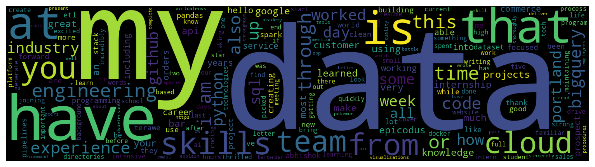
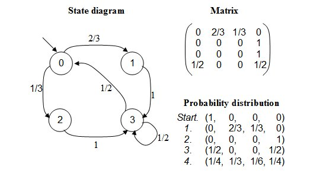

# _Resume Writer_

#### By _**Bri Chavez**_

#### _The Markov principle involves defining the likelihood of a future action based soley off current state of a variable. Once the probabilities of future actions at each state are determined, a nested dictionary can be created, and the likelihood of a result can be calculated. Markov models can be used to recognize patterns, make predictions and to learn the statistics of sequential data. Applications include modeling languages, natural language processing, image processing, Bioinformatics, speech recognition, and modeling computer hardware and software systems._

<<<<<<< HEAD

=======

>>>>>>> bf6ffa0973c2c0331433cb640ea9a59b8c02bfee

## Description

_One of the things I, and numerous others, dread doing is writing cover letters. So, I decided to write a code to do just that. Enacting the Markov chain, we are able to take in a variety of types of resumes and, depending on the the frequency that certain words follow each specific word, we can output and almost pass-offable cover letter._
_This program runs through each word in a give text, lower cases them all, drops out all the non-english sounding words, a few garbage words, and expands all the contracted words. Then, we construct a nested dictionary with every distinct word is a key in the outer dictionary. The words that directly follow that key word will be a key value pair attached to it. the value being the amount of times it follows the main word in the text. From this we can determine the likelyhood of that pattern occuring. Starting with a random word, we start our journey. Using that random word, we pull up all its key value pairs of words that may follow it. Using weighted probability, we pick one. Rinse and repeat until the story is out desired length. Now for the clean up. We have to strip the spaces before the puncuation. A residule from the join. We then capitalize the first word of the sentnces, make a new parapgraph at a random intervial between 4 and 8, and tab the first line of each paragraph. Then we run it through a spell check and send it off to our prospective employers

## Technologies Used

* _Python_
* _Pandas_
* _PyPDF2_
* _Numpy_
* _Matplotlib_
* _Word_cloud_
* _Markdown_
* _Json_
* _Language_tools_python_

## More about Markov

## Known Bugs

* _Just starting out so its not really working_

## License

_If you'd to discuss any of my code or are wondering more detailed instructions on the training in different fields, feel free to email me at brianachavez@gmail.com_

Copyright (c) _July 2022_ _Bri Chavez_
